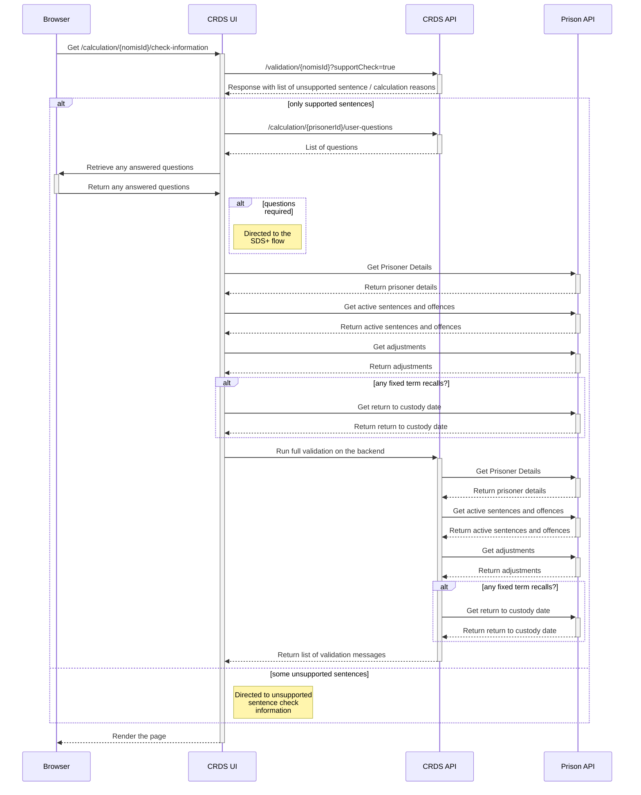

# Check Information

## Sequence Diagram
The check information page allows us to view the sentence and offence information, along with any validation
messages that have been created by the backend.

## Support Check Flag
The support check flag will run a small portion of the validation service, to determine of the sentences and scenarios are supported by the service.
If there are unsupported sentences we will redirect the user to the [Check Information Unsupported Sentence](check-information-unsupported-sentence.md) page, with its subsequent manual entry flow.