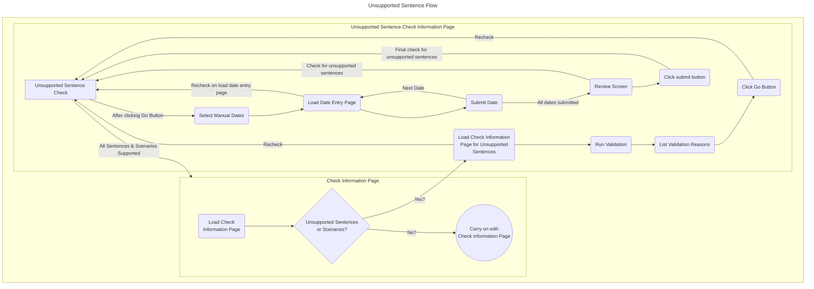

# Check Information Unsupported Sentence

This is the start of the unsupported sentence manual entry flow.

A check is performed here to ensure that there are unsupported sentences.

It is imperative that a user cannot enter dates for a sentence that *could* be calculated by the Calculate Release Dates service.
For this reason we check at each stage that there are still unsupported sentences or scenarios. This check is not a full validation, but simply a 
cut down version of the check.

If at any point we detect that the sentence or scenario is supported by the CRDS we redirect the user back to the Check Information screen so that the release dates could be calculated by the service.