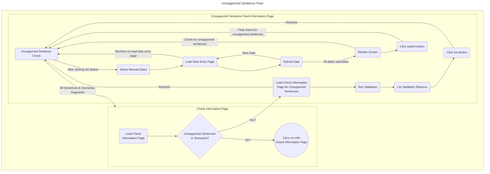
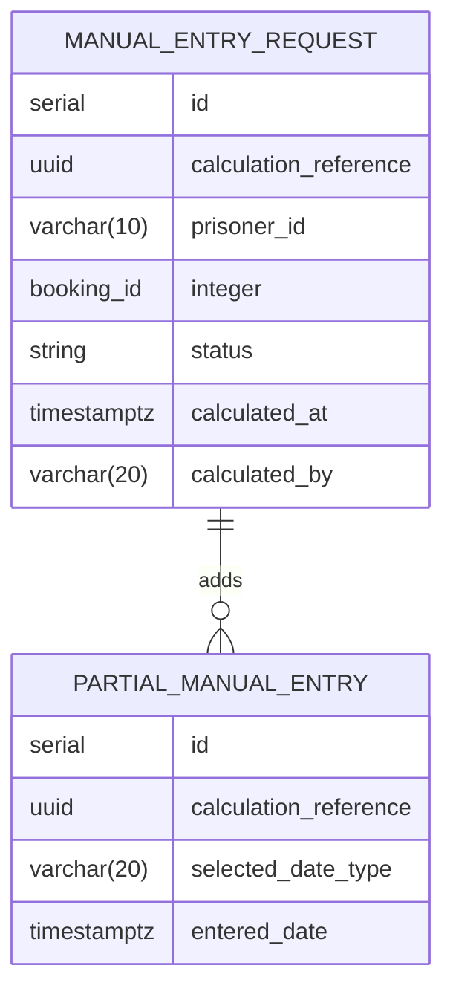
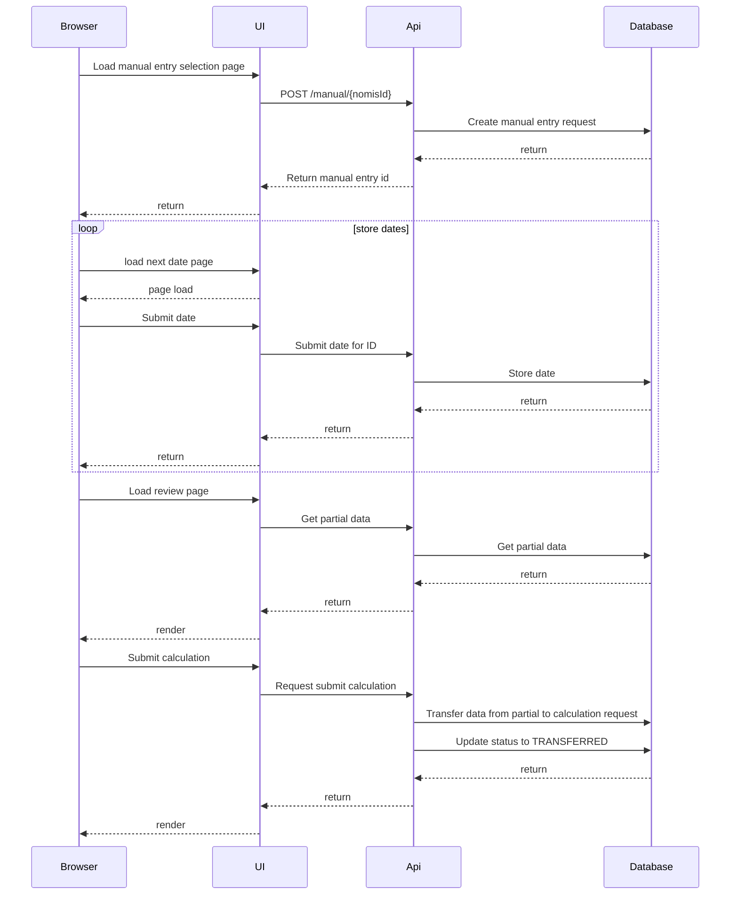

# Check Information Unsupported Sentence

This is the start of the unsupported sentence manual entry flow.

A check is performed here to ensure that there are unsupported sentences.

It is imperative that a user cannot enter dates for a sentence that *could* be calculated by the Calculate Release Dates service.
For this reason we check at each stage that there are still unsupported sentences or scenarios. This check is not a full validation, but simply a 
cut down version of the check.

If at any point we detect that the sentence or scenario is supported by the CRDS we redirect the user back to the Check Information screen so that the release dates could be calculated by the service.

## Manual Entry Storage
In order to avoid partial calculations being stored as preliminary calculations, and thus muddying the waters, I believe we need to take 
an approach whereby we build up data, and transfer it to a prelimnary calculation afterwards.

Below is a potential sequence diagram for manual entry. This keeps the calculation data set clean with only submitted entries.
Potential statuses:
* IN_PROGRESS
* TRANSFERRED
* CANCELLED -> This could be future work

Once a partial calculation is in the TRANSFERRED/CANCELLED state, no more dates can be added to it.

